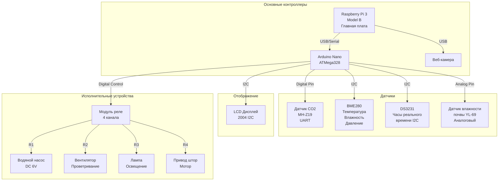

# Схема подключения минифермы

## Обзор системы

Автоматизированная система мониторинга и управления минифермой на базе Raspberry Pi 3 и Arduino Nano.

## Архитектура системы

## Компоненты системы

### Основные контроллеры

#### Raspberry Pi 3 Model B
- **Назначение**: Главная плата управления системой
- **Питание**: 5V/3A
- **Интерфейсы**: GPIO, USB
- **Функции**: Обработка данных, веб-интерфейс, удаленное управление

#### Arduino Nano (ATMega328)
- **Назначение**: Управление датчиками и исполнительными устройствами
- **Питание**: 5V (от USB)
- **Интерфейсы**: Цифровые/Аналоговые пины
- **Функции**: Сбор данных с датчиков, управление реле

#### Веб-камера
- **Назначение**: Визуальный мониторинг
- **Подключение**: USB к Raspberry Pi
- **Функции**: Видеонаблюдение, фотофиксация

### Датчики

#### Датчик CO2 (MH-Z19)
- **Протокол**: UART
- **Назначение**: Измерение концентрации углекислого газа
- **Диапазон**: 0-5000 ppm

#### BME280
- **Протокол**: I2C
- **Параметры**:
  - Температура: -40°C до +85°C
  - Влажность: 0-100% RH
  - Атмосферное давление: 300-1100 hPa

#### DS3231
- **Протокол**: I2C
- **Назначение**: Часы реального времени
- **Особенности**: Встроенная батарея, высокая точность

#### Датчик влажности почвы (YL-69)
- **Протокол**: Аналоговый
- **Назначение**: Измерение влажности почвы
- **Выход**: 0-1023 (10-bit ADC)

### Отображение информации

#### LCD Дисплей 2004 I2C
- **Размер**: 20x4 символа
- **Протокол**: I2C
- **Назначение**: Отображение текущих показаний датчиков

### Исполнительные устройства

#### Модуль реле (4 канала)
- **Питание**: 5V
- **Управление**: Цифровые выходы Arduino
- **Каналы**:
  - **R1**: Водяной насос
  - **R2**: Вентилятор
  - **R3**: Лампа освещения
  - **R4**: Привод штор

#### Водяной насос
- **Питание**: DC 6V
- **Управление**: Реле R1
- **Назначение**: Автоматический полив

#### Вентилятор
- **Назначение**: Проветривание и циркуляция воздуха
- **Управление**: Реле R2
- **Активация**: По показаниям температуры и влажности

#### Лампа освещения
- **Управление**: Реле R3
- **Назначение**: Дополнительное освещение растений
- **Режим**: Таймер или по датчику освещенности

#### Привод штор
- **Управление**: Реле R4
- **Назначение**: Регулирование естественного освещения
- **Тип**: Мотор постоянного тока

## Протоколы связи

### I2C
- **Устройства**: BME280, DS3231, LCD дисплей
- **Преимущества**: Простота подключения, мало проводов
- **Адресация**: Каждое устройство имеет уникальный адрес

### UART
- **Устройства**: MH-Z19 (датчик CO2)
- **Настройки**: 9600 baud, 8N1
- **Подключение**: TX/RX пины Arduino

### Аналоговый
- **Устройства**: YL-69 (влажность почвы)
- **Подключение**: Аналоговые входы Arduino (A0-A7)
- **Разрешение**: 10-bit (0-1023)

### Цифровой
- **Устройства**: Управление реле
- **Логика**: HIGH/LOW для включения/выключения
- **Пины**: Цифровые выходы Arduino

## Схема питания

| Компонент | Напряжение | Ток | Источник |
|-----------|------------|-----|----------|
| Raspberry Pi 3 | 5V | 3A | Блок питания |
| Arduino Nano | 5V | 500mA | USB от Pi |
| Модуль реле | 5V | 200mA | Arduino |
| Водяной насос | 6V | 1A | Внешний БП |
| Вентилятор | 12V | 300mA | Внешний БП |
| Лампа освещения | 12V | 2A | Внешний БП |
| Привод штор | 12V | 800mA | Внешний БП |

## Функциональные возможности

### Автоматизация
- Автоматический полив по показаниям влажности почвы
- Проветривание при высокой температуре/влажности
- Включение освещения по расписанию
- Регулирование естественного освещения

### Мониторинг
- Непрерывный сбор данных с датчиков
- Веб-интерфейс для удаленного мониторинга
- Сохранение истории показаний
- Видеонаблюдение через веб-камеру

### Оповещения
- Уведомления при критических значениях
- Журнал событий
- Отправка данных в облако

## Установка и настройка

### Требования
- Raspberry Pi OS
- Arduino IDE
- Python 3.x
- Библиотеки для работы с датчиками

### Подключение
1. Подключите все компоненты согласно схеме
2. Настройте Arduino для работы с датчиками
3. Установите ПО на Raspberry Pi
4. Настройте веб-интерфейс

## Безопасность

### Электробезопасность
- Используйте предохранители для мощных устройств
- Проверьте полярность подключения
- Изолируйте соединения от влаги

### Программная безопасность
- Ограничьте доступ к веб-интерфейсу
- Используйте надежные пароли
- Регулярно обновляйте ПО

## Развитие проекта

### Возможные улучшения
- Добавление датчика pH
- Интеграция с умным домом
- Мобильное приложение
- Машинное обучение для оптимизации

### Масштабирование
- Подключение нескольких миниферм
- Централизованное управление
- Облачная аналитика
